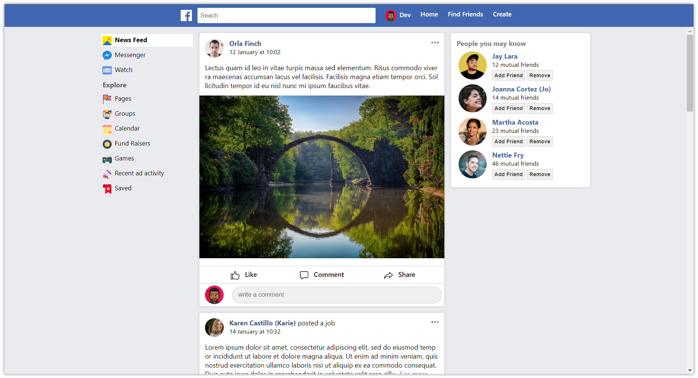

# facebook clone
[](https://github.com/devsebastian/facebook-clone/issues) 
[](https://github.com/devsebastian/facebook-clone/blob/master/LICENSE) 
[](https://twitter.com/iDevSebastian)
[](https://app.netlify.com/sites/devsebastian/deploys)

Link: [fbclone.netlify.com](https://fbclone.netlify.com/)

a facebook clone created using plain ReactJS. enjoy:)



## Getting the Sources
First, fork the facebook-clone repository so that you can make a pull request. Then, clone your fork locally:
git clone https://github.com/[your-github-account]/facebook-clone.git
Occasionally you will want to merge changes in the upstream repository (the official code repo) with your fork.

```
cd facebook-clone
git checkout master
git pull https://github.com/devsebastian/facebook-clone.git master
```
Manage any merge conflicts, commit them, and then push them to your fork.

To setup all node modules, in the terminal run:
```
npm install
```
## Production
in the terminal just run
```
npm start
```
## License
Copyright (c) 2020 Dev Sebastian.

Licensed under the MIT license.
